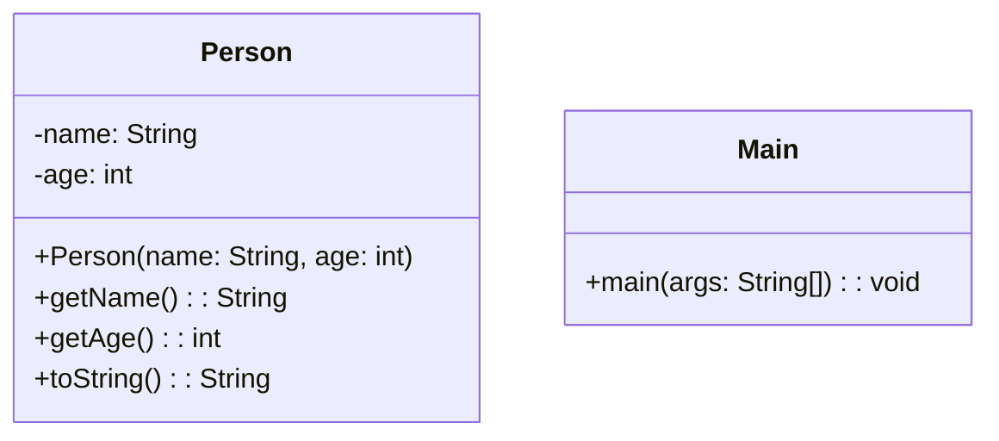

# Musterklausur: Programmieraufgaben

## Hinweise zur Klausur

- Die in dieser Klausur verwendeten Personenbezeichnungen beziehen sich – sofern nicht anders kenntlich gemacht – auf alle Geschlechter.
- Pakete und Klassenimporte müssen nicht angegeben werden.
- Es kann davon ausgegangen werden, dass sämtliche Klassen entsprechende Implementierungen der `Object`-Methoden besitzen.
- So nicht anders angegeben sollen Konstruktoren, Setter, Getter sowie die `Object`-Methoden wie in der Vorlesung gezeigt implementiert werden.
- Die Konsolenausgabe-Methoden der Klasse `PrintStream` dürfen sinnvoll gekürzt geschrieben werden (z. B. `syso("Hello World")` statt `System.out.println("Hello World")`).
- Methoden- und Attributsbezeichner dürfen sinnvoll gekürzt geschrieben werden (z. B. `getLWMCP()` statt `getLectureWithMostCreditPoints()`).

---

## Aufgabe 1: Datum- und Zeitverarbeitung

### Anforderungen

1. Zeigen Sie das aktuelle Datum und die aktuelle Zeit an.
2. Lassen Sie den Benutzer ein Datum (z. B. Geburtstag) eingeben und berechnen Sie den Wochentag dieses Datums.
3. Berechnen Sie die Differenz in Tagen zwischen dem aktuellen Datum und dem eingegebenen Datum.
4. Formatieren Sie das Datum in einem lesbaren Format (z. B. `dd.MM.yyyy`).

---

## Aufgabe 2: Datei-Verarbeitung

### Anforderungen

1. Erstellen Sie eine Datei mit dem Namen `data.txt`, die folgende Inhalte enthält:

   ```plaintext
   Name;Alter;Beruf
   Hans;30;Entwickler
   Lisa;25;Designer
   Peter;35;Manager
   ```

2. Schreiben Sie ein Programm, das die Datei liest und den Inhalt Zeile für Zeile auf der Konsole ausgibt.
3. Extrahieren Sie die Daten und speichern Sie sie in einer `ArrayList` von Objekten.
4. Lassen Sie den Benutzer über die Konsole nach einem Namen suchen und geben Sie die zugehörigen Informationen aus.

---

## Aufgabe 3: Zeichenketten und Wrapper-Klassen

### Anforderungen

1. Zerlegen Sie eine Zeichenkette im Format `Hans;Peter;Lisa` in einzelne Namen und speichern Sie diese in einem Array.
2. Konvertieren Sie eine Zahl im String-Format (z. B. `"42"`) in eine Ganzzahl mithilfe von Wrapper-Klassen.
3. Lassen Sie den Benutzer eine Zahl eingeben und überprüfen Sie, ob sie positiv oder negativ ist.

---

## Aufgabe 4: Dynamische Listen und Benutzerinteraktion

### Anforderungen

1. Lassen Sie den Benutzer mehrere Zahlen eingeben und speichern Sie diese in einer `ArrayList`.
2. Berechnen Sie die Summe aller eingegebenen Zahlen.
3. Geben Sie die größte und kleinste Zahl aus der Liste aus.

---

## Aufgabe 5: Klassenstruktur

### Klassendiagramm


