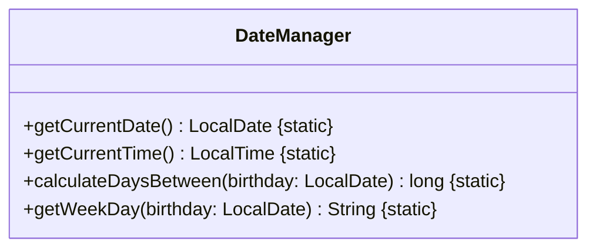
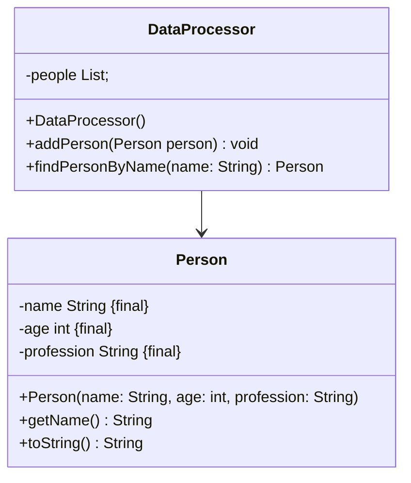
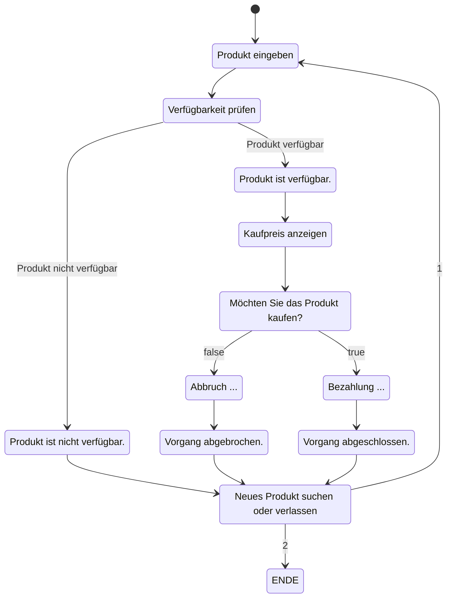
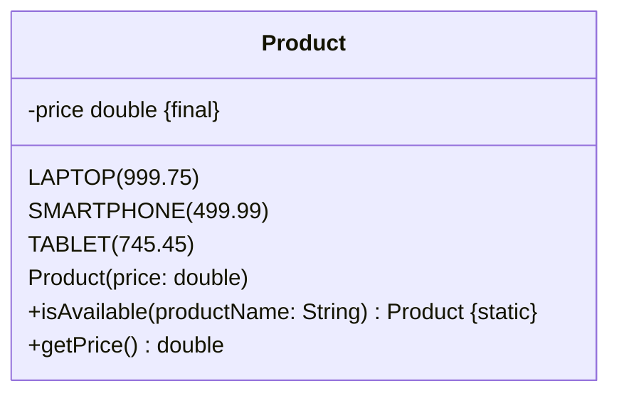

## Hinweise zur Klausur

- Diese Klausur ist auf 120 Minuten ausgelegt und umfasst 100 Punkte.
- Die in dieser Klausur verwendeten Personenbezeichnungen beziehen sich – sofern nicht anders kenntlich gemacht – auf alle Geschlechter.
- Pakete und Klassenimporte müssen nicht angegeben werden.
- Es kann davon ausgegangen werden, dass sämtliche Klassen entsprechende Implementierungen der `Object`-Methoden besitzen.
- Der Stereotyp `enumeration` impliziert, dass die Aufzählung einen passenden Konstruktor sowie gegebenenfalls passende Getter für alle Attribute besitzt.
- So nicht anders angegeben sollen Konstruktoren, Setter, Getter sowie die `Object`-Methoden wie in der Vorlesung gezeigt implementiert werden.
- Die Konsolenausgabe-Methoden der Klasse `PrintStream` dürfen sinnvoll gekürzt geschrieben werden (z. B. `syso("Hello World")` statt `System.out.println("Hello World")`).

---

# Aufgabe 1 (40 Punkte)

Implementiere die Klasse `DateManager` und die zugehörigen Methoden gemäß des abgebildeten Klassendiagramms.

## 1.1 Implementierung der Klasse `DateManager` (25 Punkte)

1. **Methode `getCurrentDate()` (5 Punkte)**

   - Implementiere die Methode `getCurrentDate()`, welche das aktuelle Datum als `LocalDate` zurückgibt.

2. **Methode `getCurrentTime()` (5 Punkte)**

   - Implementiere die Methode `getCurrentTime()`, welche die aktuelle Uhrzeit als `LocalTime` zurückgibt.

3. **Methode `calculateDaysBetween(LocalDate birthday)` (10 Punkte)**

   - Implementiere die Methode `calculateDaysBetween(birthday: LocalDate)`, welche die Anzahl der Millisekunden zwischen dem übergebenen `birthday` und der aktuellen Zeit (`now()`) berechnet. Nutze dabei `LocalDate.atStartOfDay(ZoneId.systemDefault())`, um das Datum zu einem `LocalDateTime` um Mitternacht zu konvertieren und die aktuelle Zeitzone zu verwenden.

4. **Methode `getWeekDay(LocalDate date)` (5 Punkte)**
   - Implementiere die Methode `getWeekDay(date: LocalDate)`, welche den Wochentag für ein angegebenes Datum zurückgibt.

## 1.2 Implementierung der ausführbaren Klasse `ExamTask01` (15 Punkte)

1. **Aktuelles Datum und aktuelle Uhrzeit ausgeben (1 Punkt)**

   - Implementiere die Ausgabe des aktuellen Datums und der aktuellen Uhrzeit auf der Konsole.

2. **Benutzeraufforderung zur Eingabe eines Datums (4 Punkte)**

   - Fordere den Benutzer auf, ein Datum im Format `yyyy-MM-dd` einzugeben.

3. **Wochentag des eingegebenen Datums berechnen und anzeigen (3 Punkte)**

   - Berechne den Wochentag des vom Benutzer eingegebenen Datums und zeige diesen auf der Konsole an.

4. **Differenz in Tagen zwischen aktuellem Datum und eingegebenem Datum berechnen und anzeigen (8 Punkte)**
   - Berechne die Differenz in Tagen zwischen dem aktuellen Datum und dem eingegebenen Datum und zeige diese Differenz auf der Konsole an.

## Klassendiagramm



## Beispielhafte Konsolenausgabe

```plaintext
Aktuelles Datum: 01.12.2024
Aktuelle Uhrzeit: 14:30
Geben Sie ihr Geburtsdatum ein (yyyy-MM-dd): 1990-01-01
Sie sind an einem MONDAY geboren.
Sie sind ca. 708618917429 ms alt.
```

---

# Aufgabe 2 (30 Punkte)

Implementiere die Klasse `DataProcessor` und die zugehörigen Methoden gemäß des abgebildeten Klassendiagramms. Implementiere auch die Klasse `Person`, die zur Verwaltung der Personendaten dient.

## 2.1 Implementierung der Klasse `DataProcessor` (15 Punkte)

1. **Konstruktor und Datenstruktur (5 Punkte)**

   - Erstelle den Konstruktor `DataProcessor()` und initialisiere die interne Liste `people` zur Speicherung von `Person`-Objekten.
   - Die Klasse `DataProcessor` muss eine Datenstruktur zur Verwaltung der `Person`-Objekte enthalten.

2. **Methode `addPerson(Person person)` (5 Punkte)**

   - Implementiere die Methode `addPerson(person: Person)`, welche das übergebene `Person`-Objekt der Liste `people` hinzufügt.

3. **Methode `findPersonByName(String name)` (5 Punkte)**
   - Implementiere die Methode `findPersonByName(name: String)`, welche nach einer Person anhand des Namens in der Liste `people` sucht und das entsprechende `Person`-Objekt zurückgibt. Wenn keine Person gefunden wird, soll `null` zurückgegeben werden.

## 2.2 Implementierung der ausführbaren Klasse `ExamTask02` (15 Punkte)

1. **Einlesen von Personendaten aus Datei (7 Punkte)**

   - Implementiere das Einlesen der Datei `data.txt` und erstelle daraus `Person`-Objekte, die der Liste `people` im `DataProcessor` hinzugefügt werden.
   - Verarbeite die Daten im Format `name;age;profession` und achte darauf, die Daten korrekt in die Attribute der Klasse `Person` zu übertragen.

2. **Benutzereingabe und Suche nach einer Person (8 Punkte)**
   - Implementiere eine Benutzereingabe, die nach einem Namen fragt.
   - Suche die entsprechende Person mithilfe der Methode `findPersonByName(name: String)` und gebe die Informationen der Person auf der Konsole mit der Methode `toString()` aus. Wenn keine Person gefunden wird, soll eine entsprechende Nachricht angezeigt werden.

### Klassendiagramm



## data.txt (name|age|profession)

```plaintext
Hans;40;Entwickler
Lisa;25;Designer
Peter;35;Manager
```

## Beispielhafte Konsolenausgabe

```plaintext
Geben Sie einen Namen ein: Lisa
Ergebnis: [[name=Lisa],[age=25],[profession=Designer]]
```

---

# Aufgabe 3 (30 Punkte)

Implementiere die Enumeration `Product` und die zugehörigen Methoden gemäß des abgebildeten Klassendiagramms. Implementiere auch die ausführbare Klasse `ExamTask03`, die den Bestellprozess gemäß des angegebenen Aktivitätsdiagramms umsetzt.

## 3.1 Implementierung der Enumeration `Product` (10 Punkte)

1. **Verfügbare Produkte definieren (3 Punkte)**

   - Definiere die Produkte `LAPTOP`, `SMARTPHONE` und `TABLET` in der Enumeration `Product`, wobei jedes Produkt einen Preis besitzt.

2. **Konstruktor und Attribut `price` (3 Punkte)**

   - Implementiere den Konstruktor der Enumeration `Product`, welcher das Attribut `price` initialisiert.

3. **Methode `isAvailable(String productName)` (2 Punkte)**

   - Implementiere die Methode `isAvailable(productName: String)`, welche überprüft, ob das angegebene Produkt verfügbar ist.

4. **Methode `getPrice()` (2 Punkte)**
   - Implementiere die Methode `getPrice()`, welche den Preis des Produkts zurückgibt.

## 3.2 Implementierung der ausführbaren Klasse `ExamTask03` (20 Punkte)

1. **Benutzereingabe zur Produktauswahl (4 Punkte)**
2. **Verfügbarkeit prüfen (4 Punkte)**
3. **Kaufpreis anzeigen (3 Punkte)**
4. **Kaufabfrage und Prozessfortführung (5 Punkte)**
5. **Bestellprozess abschließen oder wiederholen (4 Punkte)**

### Aktivitätsdiagramm



### Klassendiagramm `Product`



## Beispielhafte Konsolenausgabe

```plaintext
Produkt suchen: LAPTOP
Verfügbarkeit prüfen...
Produkt ist verfügbar. || Produkt ist nicht verfügbar.
Der Kaufpreis ist: 999.75$
Möchte sie das Produkt kaufen Ja= [true] Nein =[false]? true || false
Bezahlung ... || Abbruch ...
Vorgang abgeschlossen. || Vorgang abgebrochen.
Neues Produkt suchen [1] oder verlassen [2] ? 2
Verlassen ...
```

---

---

## Hinweisse

```plaintext
DayOfWeek java.time.LocalDate.getDayOfWeek()
Gets the day-of-week field, which is an enum DayOfWeek.

This method returns the enum DayOfWeek for the day-of-week. This avoids confusion as to what int values mean. If you need access to the primitive int value then the enum provides the int value.
```

```plaintext
String java.lang.Enum.toString()
Returns the name of this enum constant, as contained in the declaration. This method may be overridden, though it typically isn't necessary or desirable. An enum class should override this method when a more "programmer-friendly" string form exists.

Overrides: toString() in Object

Returns:

the name of this enum constant
```

```plaintext
LocalDate.atStartOfDay(ZoneId.systemDefault()) - Konvertiert das Datum zu einem LocalDateTime um Mitternacht und verwendet die aktuelle Zeitzone.
.toInstant() - Wandelt es in ein Instant um.
.toEpochMilli() - Konvertiert den Zeitpunkt in Millisekunden seit der Epoche (Unix-Zeitstempel).
```

```plaintext
String java.lang.Enum.value()
Returns the values as array of this enum constants, exactly as declared in its enum declaration.

Returns:

the the values as arry of this enum constants

```

```plaintext
String java.lang.Enum.name()
Returns the name of this enum constant, exactly as declared in its enum declaration. Most programmers should use the toString method in preference to this one, as the toString method may return a more user-friendly name. This method is designed primarily for use in specialized situations where correctness depends on getting the exact name, which will not vary from release to release.

Returns:

the name of this enum constant
```
