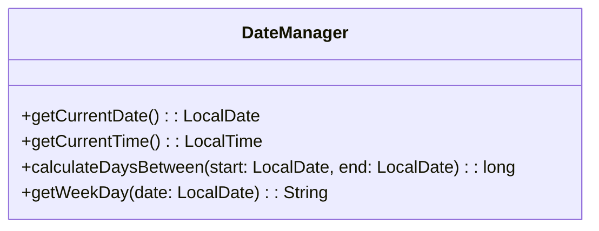
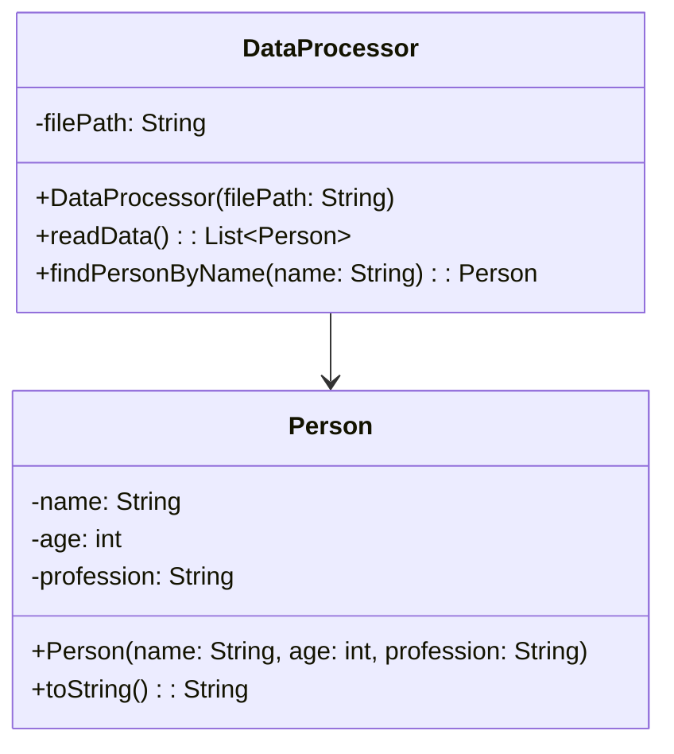
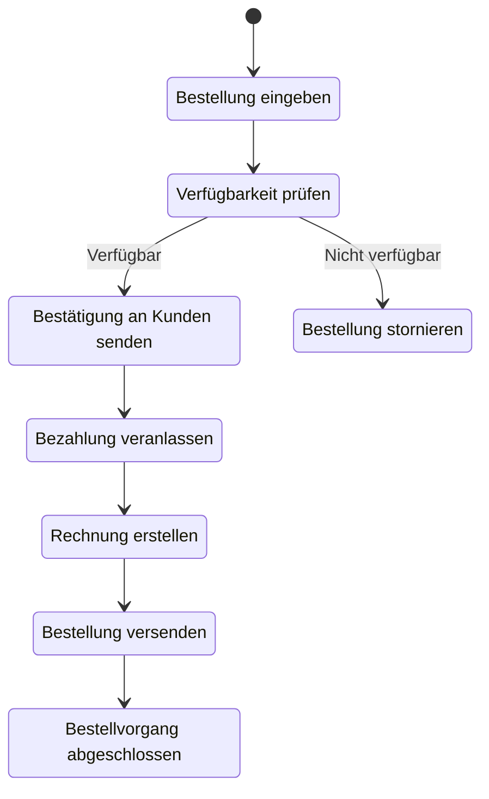
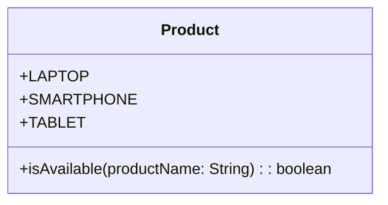
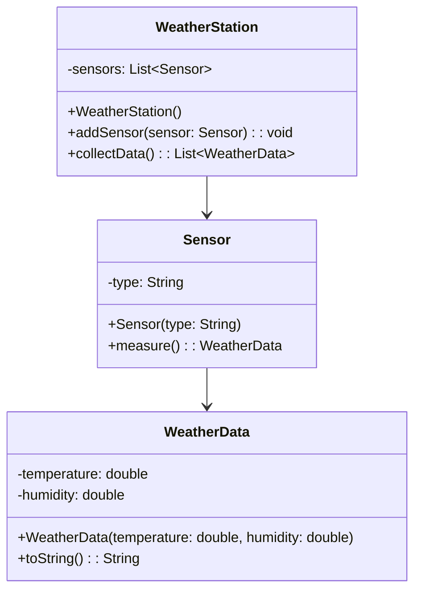

## Hinweise zur Klausur

- Diese Klausur ist auf 120 Minuten ausgelegt und umfasst 100 Punkte.
- Die in dieser Klausur verwendeten Personenbezeichnungen beziehen sich – sofern nicht anders kenntlich gemacht – auf alle Geschlechter.
- Pakete und Klassenimporte müssen nicht angegeben werden.
- Es kann davon ausgegangen werden, dass sämtliche Klassen entsprechende Implementierungen der `Object`-Methoden besitzen.
- Der Stereotyp `enumeration` impliziert, dass die Aufzählung einen passenden Konstruktor sowie gegebenenfalls passende Getter für alle Attribute besitzt.
- So nicht anders angegeben sollen Konstruktoren, Setter, Getter sowie die `Object`-Methoden wie in der Vorlesung gezeigt implementiert werden.
- Die Konsolenausgabe-Methoden der Klasse `PrintStream` dürfen sinnvoll gekürzt geschrieben werden (z. B. `syso("Hello World")` statt `System.out.println("Hello World")`).

---

## Aufgabe 1 (25 Punkte)

- Erstelle die Klasse `DateManager` anhand des abgebildeten Klassendiagramms (20 Punkte).
- Implementiere die ausführbare Klasse `ExamTask01` (5 Punkte). Diese soll:
  - Das aktuelle Datum und die aktuelle Uhrzeit ausgeben.
  - Den Benutzer auffordern, ein Datum einzugeben, und den Wochentag sowie die Differenz in Tagen berechnen.

### Klassendiagramm



## Beispielhafte Konsolenausgabe

```plaintext
Aktuelles Datum: 01.12.2024
Aktuelle Uhrzeit: 14:30
Geben Sie ein Datum ein (yyyy-MM-dd): 1990-01-01
Der Wochentag ist: Montag
Differenz in Tagen: 12784
```

---

## Aufgabe 2 (25 Punkte)

- Implementiere die Klasse `DataProcessor` anhand des abgebildeten Klassendiagramms (15 Punkte).
- Erstelle die Klasse `ExamTask02` (10 Punkte), die:
  - Eine Datei `data.txt` mit Personendaten einliest.
  - Den Benutzer auffordert, nach einem Namen zu suchen.
  - Die zugehörigen Informationen ausgibt.

### Klassendiagramm



## Beispielhafte Konsolenausgabe

```plaintext
Name: Hans, Alter: 30, Beruf: Entwickler
Name: Lisa, Alter: 25, Beruf: Designer
Name: Peter, Alter: 35, Beruf: Manager
Geben Sie einen Namen ein: Lisa
Ergebnis: Name: Lisa, Alter: 25, Beruf: Designer
```

---

## Aufgabe 3 (30 Punkte)

- Erstelle die Klasse `OrderProcess` gemäß dem abgebildeten Aktivitätsdiagramm (20 Punkte).
- Implementiere eine Enumeration `Product` (10 Punkte), die eine Liste der verfügbaren Produkte enthält.

### Aktivitätsdiagramm



### Klassendiagramm `Product`



## Beispielhafte Konsolenausgabe

```plaintext
Bestellung eingeben: Laptop
Verfügbarkeit prüfen...
Produkt ist verfügbar.
Bestätigung an Kunden senden: Ihre Bestellung ist verfügbar.
Bezahlung veranlassen...
Rechnung wird erstellt...
Bestellung wird versendet...
Bestellvorgang abgeschlossen.
```

---

## Aufgabe 4 (20 Punkte)

- Implementiere die Klassen `WeatherStation`, `Sensor`, und `WeatherData` gemäß dem abgebildeten Klassendiagramm (15 Punkte).
- Erstelle eine ausführbare Klasse `WeatherApp` (5 Punkte), die:
  - Mehrere Sensoren zur Wetterstation hinzufügt.
  - Die gemessenen Wetterdaten auf der Konsole ausgibt.

### Klassendiagramm



## Beispielhafte Konsolenausgabe

```plaintext
Sensor hinzugefügt: Temperatur
Sensor hinzugefügt: Luftfeuchtigkeit
Gemessene Wetterdaten:
Temperatur: 22.5°C, Luftfeuchtigkeit: 60%
```

---
