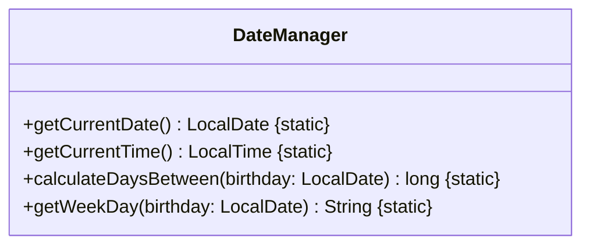
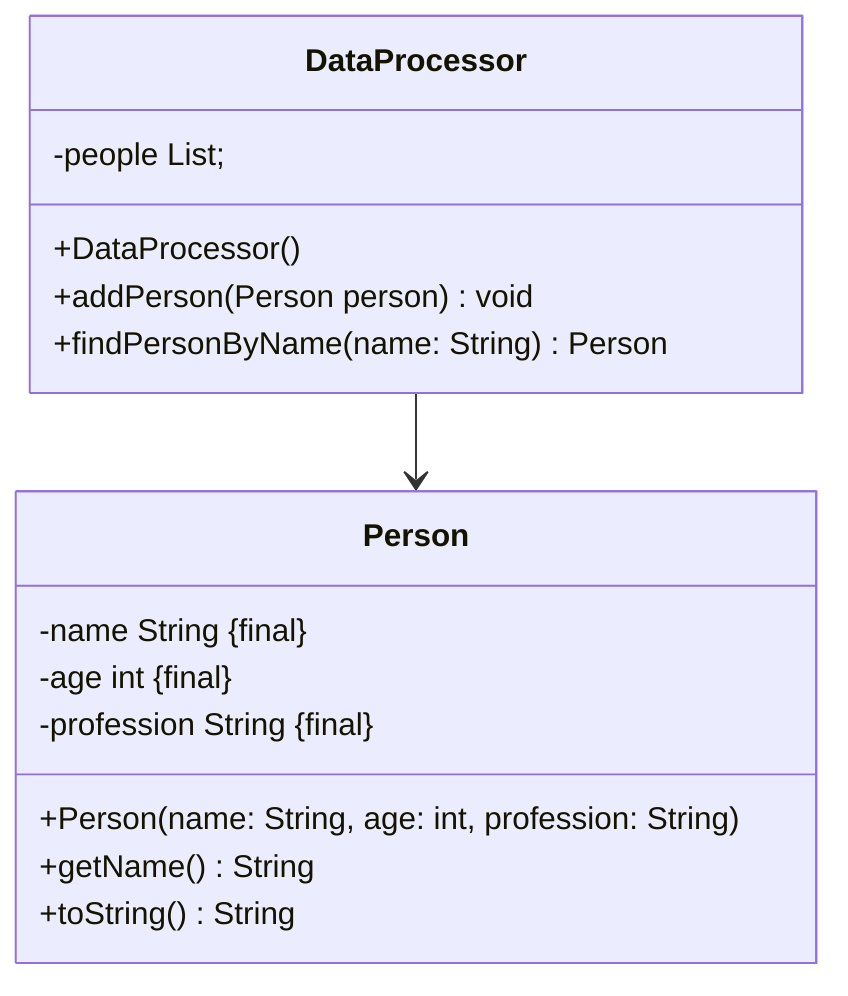
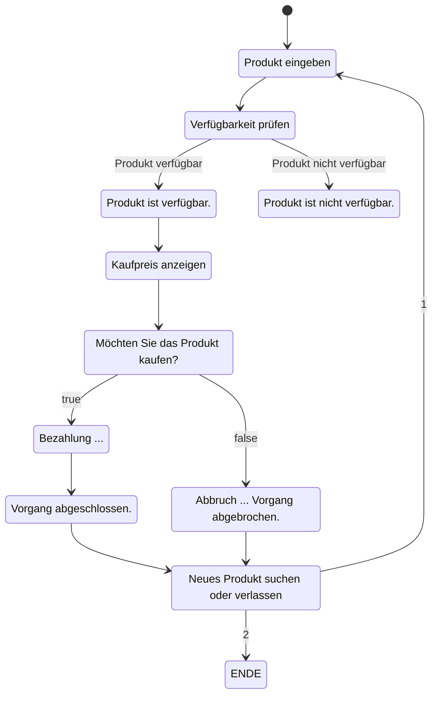
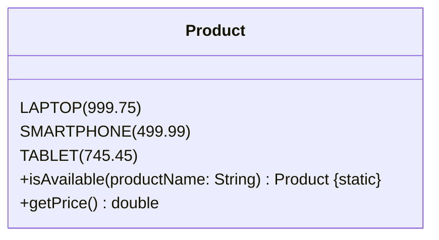
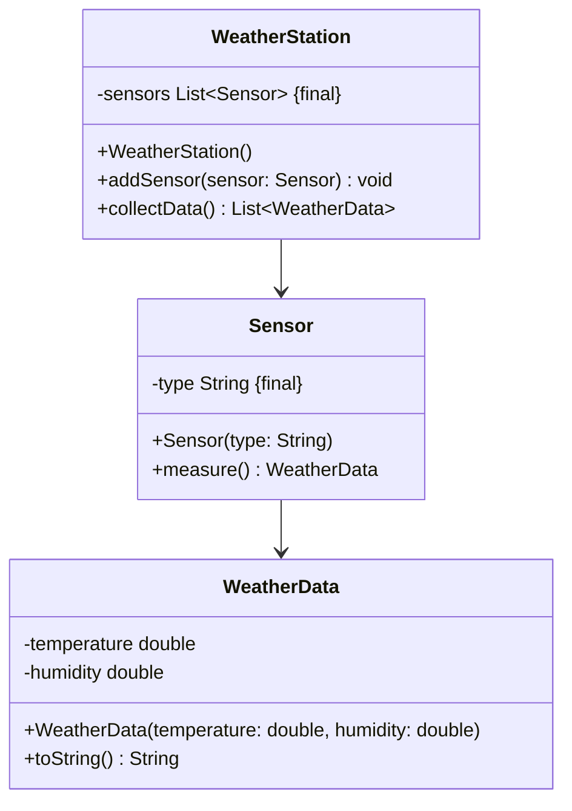

## Hinweise zur Klausur

- Diese Klausur ist auf 120 Minuten ausgelegt und umfasst 100 Punkte.
- Die in dieser Klausur verwendeten Personenbezeichnungen beziehen sich – sofern nicht anders kenntlich gemacht – auf alle Geschlechter.
- Pakete und Klassenimporte müssen nicht angegeben werden.
- Es kann davon ausgegangen werden, dass sämtliche Klassen entsprechende Implementierungen der `Object`-Methoden besitzen.
- Der Stereotyp `enumeration` impliziert, dass die Aufzählung einen passenden Konstruktor sowie gegebenenfalls passende Getter für alle Attribute besitzt.
- So nicht anders angegeben sollen Konstruktoren, Setter, Getter sowie die `Object`-Methoden wie in der Vorlesung gezeigt implementiert werden.
- Die Konsolenausgabe-Methoden der Klasse `PrintStream` dürfen sinnvoll gekürzt geschrieben werden (z. B. `syso("Hello World")` statt `System.out.println("Hello World")`).

---

## Aufgabe 1 (25 Punkte)

- Erstelle die Klasse `DateManager` anhand des abgebildeten Klassendiagramms. Dabei sollen folgende Methoden implementiert werden:
  - Gibt das aktuelle Datum als `LocalDate` zurück.
  - Gibt die aktuelle Uhrzeit als `LocalTime` zurück.
  - Berechnet die Anzahl der Millisekundn zwischen `birthday` und now().
    (LocalDate.atStartOfDay(ZoneId.systemDefault()) - Konvertiert das Datum zu einem LocalDateTime um Mitternacht und verwendet die aktuelle Zeitzone. Wobei LocalDate dem Typ LocalDate entsprechne muss)
  - Gibt den Wochentag für ein angegebenes Datum zurück. (20 Punkte)
- Implementiere die ausführbare Klasse `ExamTask01` (5 Punkte). Diese soll:
  - Das aktuelle Datum und die aktuelle Uhrzeit auf der Konsole ausgeben.
  - Den Benutzer auffordern, ein Datum im Format `yyyy-MM-dd` einzugeben.
  - Den Wochentag des eingegebenen Datums berechnen und anzeigen.
  - Die Differenz in Tagen zwischen dem aktuellen Datum und dem eingegebenen Datum berechnen und anzeigen.

### Klassendiagramm



## Beispielhafte Konsolenausgabe

```plaintext
Aktuelles Datum: 01.12.2024
Aktuelle Uhrzeit: 14:30
Geben Sie ihr Geburtsdatum ein (yyyy-MM-dd): 1990-01-01
Sie sind an einem MONDAY geboren.
Sie sind ca. 708618917429 ms alt.
```

---

## Aufgabe 2 (25 Punkte)

- Implementiere die Klasse `DataProcessor` anhand des abgebildeten Klassendiagramms. Dabei sollen folgende Methoden umgesetzt werden:
  - `addPerson(person: Person)`: fügt `people` ein `Person`-Objekt an.
  - `findPersonByName(name: String)`: Sucht nach einer Person mit dem Namen in `people` und gibt das entsprechende `Person`-Objekt zurück. (15 Punkte)
- Erstelle die ausführbare Klasse `ExamTask02` (10 Punkte), die:
  - Eine Datei `data.txt` mit Personendaten (Name, Alter, Beruf) einliest.
  - Den Benutzer auffordert, nach einem Namen zu suchen.
  - Die zugehörigen Informationen zur eingegebenen Person auf der Konsole ausgibt mit toString().

### Klassendiagramm



## data.txt (name|age|profession)

```plaintext
Hans;40;Entwickler
Lisa;25;Designer
Peter;35;Manager
```

## Beispielhafte Konsolenausgabe

```plaintext
Geben Sie einen Namen ein: Lisa
Ergebnis: [[name=Lisa],[age=25],[profession=Designer]]
```

---

## Aufgabe 3 (30 Punkte)

- Implementiere eine Enumeration `Product` (10 Punkte), die eine Liste der verfügbaren Produkte enthält. Es sollen folgende Produkte verfügbar sein: `LAPTOP`, `SMARTPHONE`, `TABLET`. Die Enumeration enthält eine Methode `isAvailable(String productName)`, die prüft, ob ein Produkt verfügbar ist.
- Erstelle die ausführbare Klasse `ExamTask03` als gemäß dem abgebildeten Aktivitätsdiagramm (20 Punkte). Dabei sollen die Schritte des Bestellprozesses (Eingabe, Verfügbarkeit, Bestätigung, Bezahlung, Rechnungserstellung, Versand) wie im Diagramm beschrieben implementiert werden.

### Aktivitätsdiagramm



### Klassendiagramm `Product`



## Beispielhafte Konsolenausgabe

```plaintext
Produkt suchen: LAPTOP
Verfügbarkeit prüfen...
Produkt ist verfügbar. || Produkt ist nicht verfügbar.
Der Kaufpreis ist: 999.75€
Möchte sie das Produkt kaufen Ja= [true] Nein =[false]? true || false
Bezahlung ... || Abbruch ...
Vorgang abgeschlossen. || Vorgang abgebrochen.
Neues Produkt suchen [1] oder verlassen [2] ? 2
Verlassen ...
```

---

## Aufgabe 4 (20 Punkte)

- Implementiere die Klassen `WeatherStation`, `Sensor`, und `WeatherData` gemäß dem abgebildeten Klassendiagramm. Dabei sollen folgende Methoden umgesetzt werden:
  - `WeatherStation`: Verwaltet eine Liste von Sensoren, ermöglicht das Hinzufügen von Sensoren und sammelt die Wetterdaten von allen Sensoren.
  - `Sensor`: Repräsentiert einen Sensor (z. B. Temperatur, Luftfeuchtigkeit) und misst Wetterdaten.
  - `WeatherData`: Enthält die gemessenen Wetterinformationen (Temperatur und Luftfeuchtigkeit). (15 Punkte)
- Erstelle eine ausführbare Klasse `WeatherApp` (5 Punkte), die:
  - Mehrere Sensoren zur Wetterstation hinzufügt.
  - Die gemessenen Wetterdaten auf der Konsole ausgibt.

### Klassendiagramm



## Beispielhafte Konsolenausgabe

```plaintext
Sensor hinzugefügt: Temperatur
Sensor hinzugefügt: Luftfeuchtigkeit
Gemessene Wetterdaten:
Temperatur: 22.5°C, Luftfeuchtigkeit: 60%
```

---

## Hinweisse

```plaintext
DayOfWeek java.time.LocalDate.getDayOfWeek()
Gets the day-of-week field, which is an enum DayOfWeek.

This method returns the enum DayOfWeek for the day-of-week. This avoids confusion as to what int values mean. If you need access to the primitive int value then the enum provides the int value.
```

```plaintext
String java.lang.Enum.toString()
Returns the name of this enum constant, as contained in the declaration. This method may be overridden, though it typically isn't necessary or desirable. An enum class should override this method when a more "programmer-friendly" string form exists.

Overrides: toString() in Object

Returns:

the name of this enum constant
```

```plaintext
LocalDate.atStartOfDay(ZoneId.systemDefault()) - Konvertiert das Datum zu einem LocalDateTime um Mitternacht und verwendet die aktuelle Zeitzone.
.toInstant() - Wandelt es in ein Instant um.
.toEpochMilli() - Konvertiert den Zeitpunkt in Millisekunden seit der Epoche (Unix-Zeitstempel).
```

```plaintext
String java.lang.Enum.value()
Returns the values as array of this enum constants, exactly as declared in its enum declaration.

Returns:

the the values as arry of this enum constants

```

```plaintext
String java.lang.Enum.name()
Returns the name of this enum constant, exactly as declared in its enum declaration. Most programmers should use the toString method in preference to this one, as the toString method may return a more user-friendly name. This method is designed primarily for use in specialized situations where correctness depends on getting the exact name, which will not vary from release to release.

Returns:

the name of this enum constant
```
