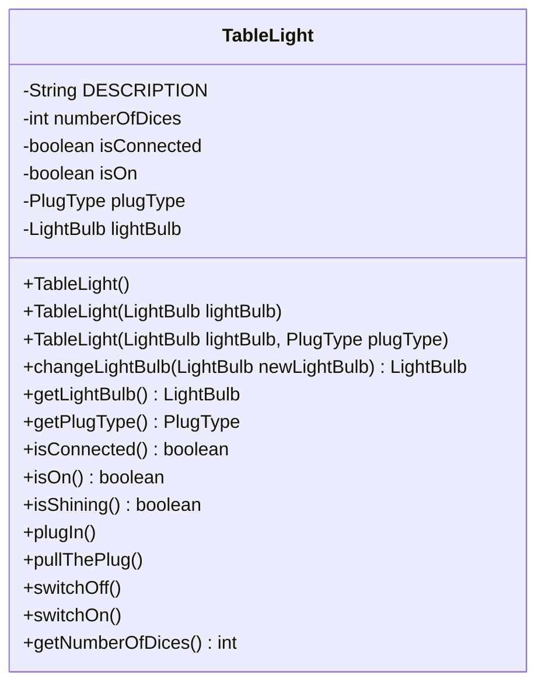

```mermaid
classDiagram
    class TableLight {
        +TableLight()
        +TableLight(LightBulb lightBulb)
        +TableLight(LightBulb lightBulb, PlugType plugType)
        +changeLightBulb(LightBulb newLightBulb) LightBulb
        +getLightBulb() LightBulb
        +getPlugType() PlugType
        +isConnected() boolean
        +isOn() boolean
        +isShining() boolean
        +plugIn()
        +pullThePlug()
        +switchOff()
        +switchOn()
        +getNumberOfDices() int
        -String DESCRIPTION
        -int numberOfDices
        -boolean isConnected
        -boolean isOn
        -PlugType plugType
        -LightBulb lightBulb
    }
```
