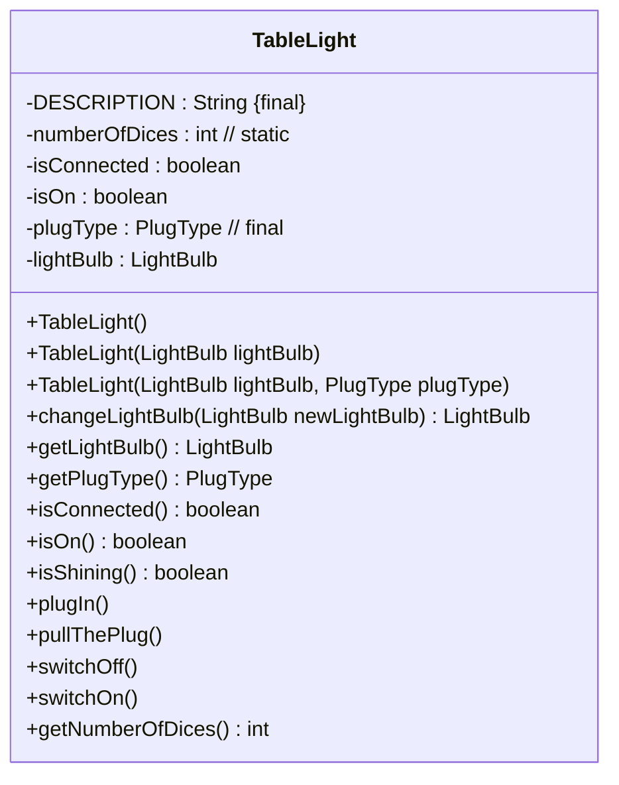

```mermaid
classDiagram
    class TableLight {
        +TableLight()
        +TableLight(LightBulb lightBulb)
        +TableLight(LightBulb lightBulb, PlugType plugType)
        +changeLightBulb(LightBulb newLightBulb) LightBulb
        +getLightBulb() LightBulb
        +getPlugType() PlugType
        +isConnected() boolean
        +isOn() boolean
        +isShining() boolean
        +plugIn()
        +pullThePlug()
        +switchOff()
        +switchOn()
        +getNumberOfDices() int
        -DESCRIPTION : String #123;final#125;
        -numberOfDices : int // static
        -isConnected : boolean
        -isOn : boolean
        -plugType : PlugType // final
        -lightBulb : LightBulb
    }
```
